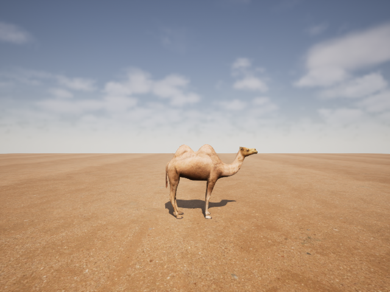
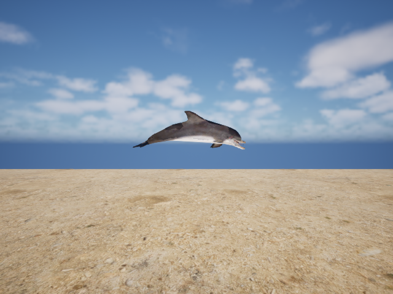
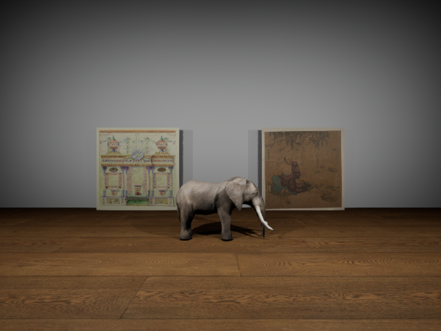

# Photorealistic Synthetic Dataset Generation

This dataset generation pipeline utilizes Unreal Engine 5 (UE5) and Python script to generate a PUG-style dataset used for the reproduction of the [paper](https://arxiv.org/pdf/2506.15871).

## The Cast
There are three characters in this dataset. Let's start by meeting them.

  
  
  

  <em>(Left to Right: Camel in the Salt Desert, Dolphin at the Beach, Elephant in the Museum)</em>

---

## Setup & Installation

The System Requirements for running UE5 are described [here](https://dev.epicgames.com/documentation/unreal-engine/hardware-and-software-specifications-for-unreal-engine?application_version=5.6). Note that you should install the *"Game development with C++"* workload in the Visual Studio Installer.

UnrealCV bridges Python to UE5 to manipulate objects with code, so you need to install the UnrealCV plugin before running the generation script.
1. Download the UnrealCV plugin source code as a `.zip` file from the official GitHub [repository](https://github.com/unrealcv/unrealcv).
2. Extract files from the `.zip` and place the root folder inside your UE5 project's `Plugins` folder (create the `Plugins` folder in your project directory if it doesn't exist).
3. Close your UE5 project and double-click your `.uproject` file to reopen your UE5 project.
4. The engine will detect the new plugin and prompt you to rebuild the missing modules. Click **Yes** to trigger the automatic building process.

---

## Generating the Dataset

1. Search for and download 3D models for camel, dolphin and elephant and textures for floors/terrains as well as your preferred decorations in different environments. Arrange them in UE5 appropriately. Ensure all animal meshes have their Transform Mobility set to **Movable**.

2. Launch the Engine when you have done arranging the 3D assets, and hit the green **Play** button in the editor.

3. Open a terminal and run:
   
   `pip install -r requirements.txt`
   
   `python src/data/generate_pug_dataset.py`

---

## The Dataset Split
The script generates 3 * 3 * 2 * 3 * 3 = 162 distinct combinations of the 3 animals, 3 colors, and 3 environments (excluding identical color pairs) with two images for each combination where the positions of animals are slightly jittered in all three dimensions and rotated around the `z` axis. It also shuffles the combinations before splitting them into two disjoint directories:
* **`est/` (Estimation):** Contains 1/3 of the dataset (54 combinations/108 images). Used for the estimation of the original and target binding IDs.
* **`eval/` (Evaluation):** Contains 2/3 of the dataset (108 combinations/216 images). Used for testing the intervention accuracy.

---

## Resource Attributions

* 3D animal models were from [Sketchfab](https://sketchfab.com).
* Textures (Floors/Terrains) were obtained from [Poly Haven](https://polyhaven.com/textures).
* Paintings in the museum environment were downloaded from [Curationist](https://www.curationist.org).
